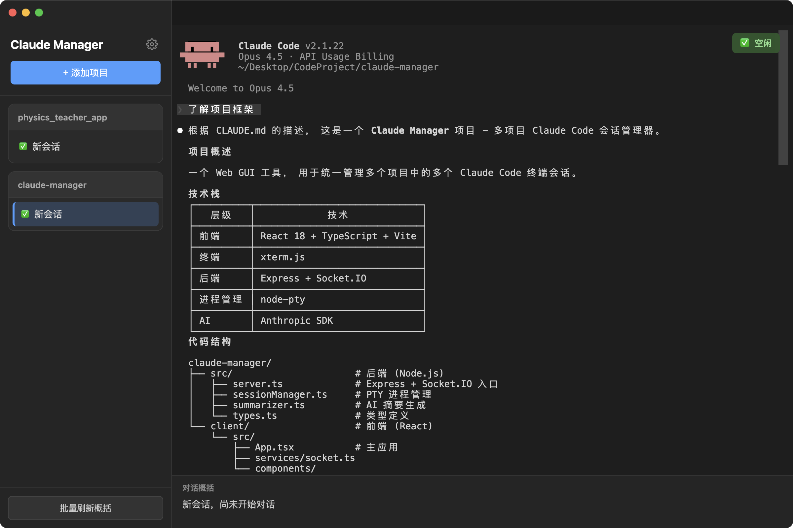

# Claude Manager

<p align="center">
  
</p>

<p align="center">
  <strong>Multi-project Claude Code Session Manager</strong>
</p>

<p align="center">
  <a href="#features">Features</a> •
  <a href="#installation">Installation</a> •
  <a href="#usage">Usage</a> •
  <a href="#development">Development</a> •
  <a href="#license">License</a>
</p>

<p align="center">
  <a href="./README.md">English</a> | <a href="./README_CN.md">中文</a>
</p>

---

## Features

- **Multi-Project Management** - Add, remove, and switch between different Git projects
- **Multi-Session Support** - Create multiple Claude Code terminal sessions per project
- **Real-time Terminal** - Full terminal interaction powered by xterm.js
- **AI Status Summary**
  - **Current Task** (Auto-refresh): Real-time detection of what Claude is doing
  - **Conversation Summary** (Manual): Generate summaries of current session content
- **Auto Update Check** - Automatically checks for new versions every 24 hours
- **Prompt Template** - Set default prompts that auto-fill when creating new sessions
- **Theme Switching** - Dark/Light theme with smooth toggle animation
- **Smart Scrolling** - Terminal only auto-scrolls when you're at the bottom

## Screenshots



## Installation

### Download Pre-built Binaries

Download the latest release for your platform from the [Releases](https://github.com/Xsquare917/claude-manager/releases) page:

- **macOS**: `Claude-Manager-x.x.x.dmg` (Intel & Apple Silicon)
- **Windows**: `Claude-Manager-Setup-x.x.x.exe`（Pending Update）

### Build from Source

```bash
# Clone the repository
git clone https://github.com/Xsquare917/claude-manager.git
cd claude-manager

# Install dependencies
npm install
cd client && npm install && cd ..

# Build and package
npm run dist:mac    # For macOS
npm run dist:win    # For Windows
npm run dist:all    # For all platforms
```

## Usage

1. Launch Claude Manager
2. Click **"+ Add Project"** to add your Git project directory
3. Click on a project to create a new Claude Code session
4. Interact with Claude Code in the integrated terminal
5. View real-time task status and generate conversation summaries

### Settings

- **Theme**: Toggle between dark and light mode
- **Shortcuts**: Customize keyboard shortcuts
- **Prompt Template**: Set a default prompt for new sessions
- **Version**: View current version and check for updates

## Development

```bash
# Install dependencies
npm install
cd client && npm install && cd ..

# Run in development mode
npm run dev

# Access the application
# Frontend: http://localhost:5173
# Backend:  http://localhost:3456
```

## Tech Stack

| Layer | Technology |
|-------|------------|
| Frontend | React 18 + TypeScript + Vite |
| Terminal | xterm.js |
| Backend | Express + Socket.IO |
| Process | node-pty |
| AI | Anthropic SDK |
| Desktop | Electron |

## License

This project is dual-licensed:

- **Non-Commercial Use**: Free for personal, educational, and non-profit use
- **Commercial Use**: Requires a commercial license

See [LICENSE](LICENSE) for details.

---

<p align="center">Made with ❤️ for Claude Code users</p>
